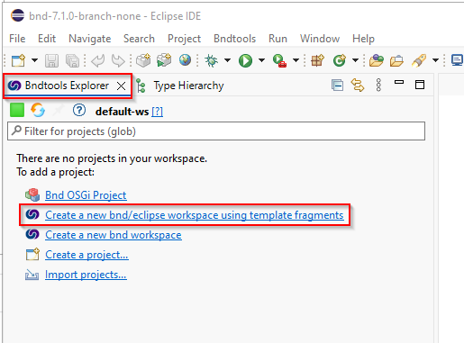
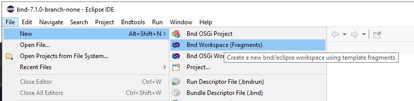
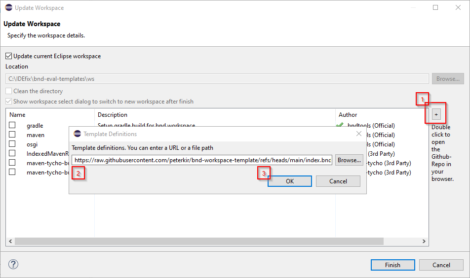

# workspace-templates
Contains bnd workspace template fragments for ecilpse bndtools

## usage

1. Open the Bnd Workspace Fragments dialog

Press `Create a new bnd/eclipse workspace using template fragments`

or

Select from the Eclipse Menu `File -> New -> Bnd Workspace (Fragments)`

2. add the custom index URI

enter following URI `https://raw.githubusercontent.com/peterkir/bnd-workspace-template/refs/heads/main/index.bnd`
